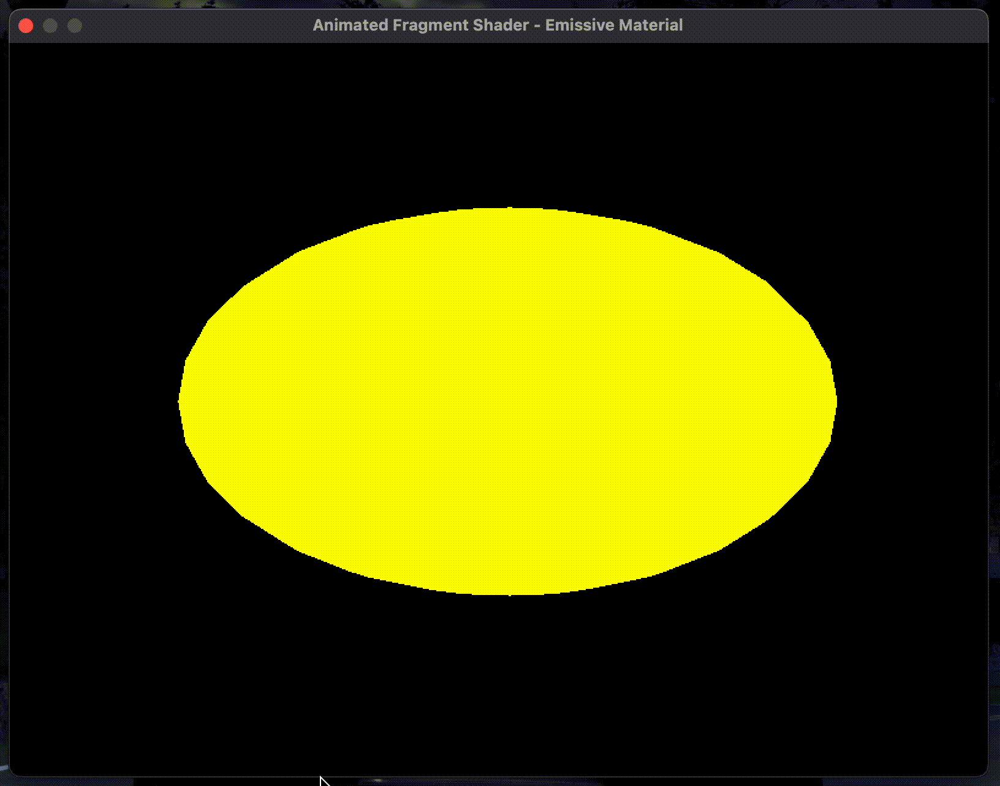
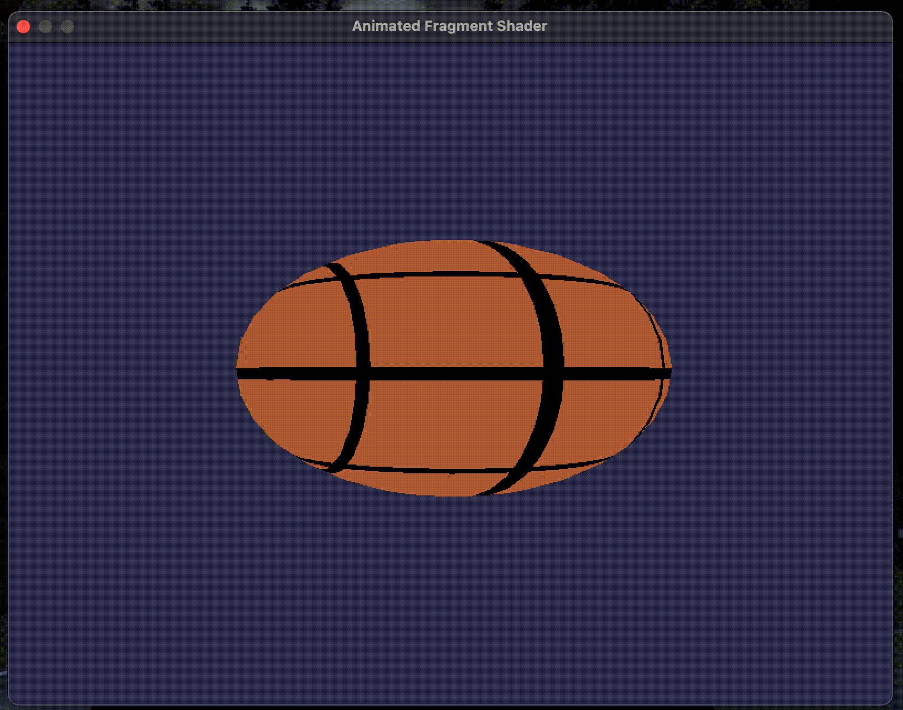

# Shader 1

# Shader 2 - Urano

# Shader 3 - Sol

# Shader 4 - Marte y sus lunas Fobos y Deimos 

# Shader 5 - Material emisivo

# Shader 6 - Pelota de basketball

Happy coding!

---
**Jorge Lopez**